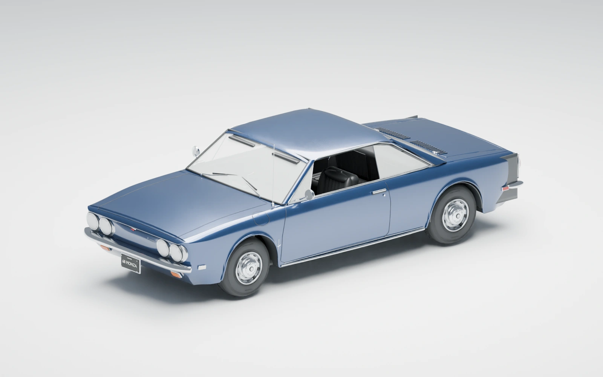

# Legacy Garage 26

**Old soul. New hands.**

The website and project archive for a youth-led restoration of a **1968 Chevrolet Corvair**, based in Reseda, California. Legacy Garage brings young builders and experienced Corvair enthusiasts together to learn through hands-on work and preserve what they discover along the way.

[Visit the website](https://www.legacygarage26.org/) · [Meet the team](https://www.legacygarage26.org/team/) · [Explore the car in 3D](https://www.legacygarage26.org/explore/)



*The blue car is a restoration vision, not a completed restoration. The website compares it with a weathered red reconstruction of the car as purchased.*

## What this website is for

Instagram shares short updates and helps people discover the project. The website keeps the longer story together:

- **A restoration archive:** document the starting condition, planned milestones, discoveries, and future progress reports.
- **A place to learn:** explore the car’s assemblies, engineering, history, and the knowledge shared by the Corvair community.
- **A home for the team’s work:** introduce the people behind the build and organize articles, interviews, photographs, and films as they become available.

## Features

- **Old/new comparison:** move across the homepage car or use the slider to compare the red as-purchased model with the blue restoration vision.
- **Interactive Corvair Anatomy viewer:** rotate, zoom, select parts, and explore exploded views across **13 functional assemblies and 4,284 selectable model objects**.
- **English and Chinese:** a shared language preference applies to the website and embedded model.
- **Meet the team:** portraits, biographies, supplied contact details, and Sam’s founder role.
- **Restoration roadmap and journal:** planned stages, searchable project notes, and category filters.
- **Responsive navigation and motion controls:** desktop dropdowns, mobile navigation, keyboard controls, a Pause motion option, and support for reduced-motion preferences.
- **Contact and social links:** email drafts, Instagram, and Facebook.

The detailed 3D viewer loads on demand. Its model assets total approximately **88 MB**, so opening it can take longer on a slow connection. The homepage comparison uses lightweight rendered images instead.

## Pages and content status

| Page | What is available |
| --- | --- |
| [Home](https://www.legacygarage26.org/) | Project introduction and interactive old/new comparison |
| [Restoration](https://www.legacygarage26.org/restoration/) | Planned restoration roadmap |
| [3D explorer](https://www.legacygarage26.org/explore/) | Interactive assemblies, parts, and model controls |
| [Our story](https://www.legacygarage26.org/about/) | Project purpose and background |
| [Meet the team](https://www.legacygarage26.org/team/) | Team profiles and portraits |
| [Journal](https://www.legacygarage26.org/journal/) | Initial project notes and the model guide |
| [Archive](https://www.legacygarage26.org/archive/) | Navigation to the project’s content collections |
| [Engineering](https://www.legacygarage26.org/engineering/) and [Resources](https://www.legacygarage26.org/resources/) | Existing guides, with more articles and references coming soon |
| [Interviews](https://www.legacygarage26.org/interviews/), [Videos](https://www.legacygarage26.org/videos/), and [History & culture](https://www.legacygarage26.org/history/) | Coming-soon pages outlining the planned collections |
| [Contact](https://www.legacygarage26.org/contact/) | Topic-based email links and social accounts |
| [Credits](https://www.legacygarage26.org/credits/) | Image attribution and model context |

Planned milestones are not presented as completed work. The current site is static: contact buttons open an email draft, and there is no backend contact form, member account system, or media-upload dashboard.

## Run locally

You need **Git** and **Python 3**. Install **Node.js** to run the verification scripts; they have been tested with Node.js 22. There is no npm dependency installation, database, or API-key setup for the website.

```sh
git clone https://github.com/yangzh0728-lgtm/1968-chevrolet-corvair.git
cd 1968-chevrolet-corvair
python3 scripts/build-pages.py
python3 -m http.server 4186 --bind 127.0.0.1 --directory dist
```

Open [http://127.0.0.1:4186/](http://127.0.0.1:4186/). Serve the site over HTTP rather than opening an HTML file directly, so JavaScript modules, translations, and model assets can load correctly.

## Repository structure

```text
site/
  shell.html          Shared header, navigation, footer, and page metadata template
  pages/              Page content fragments
  pages.json          Routes, titles, descriptions, and source filenames

dist/                 Deployable website
  */index.html        Generated pages
  *.css, *.js         Authored styles and browser behavior
  assets/             Logos, portraits, photographs, and car renders
  locales/            Website translation catalog
  anatomy/            Three.js viewer, model data, and GLB assets

scripts/
  build-pages.py      Generate page HTML using Python's standard library
  verify-site.py      Check routes, references, JavaScript syntax, and model assets
  test-*.mjs          Interaction and layout regression checks
  render/             Blender render scripts

docs/                 Project brief, proposal, credits, and verification notes
vercel.json           Static deployment configuration
```

**`dist/` is intentionally tracked in Git.** It contains both generated HTML and authored CSS, JavaScript, and assets. Do not delete it as a disposable build directory: the page generator only rebuilds the HTML pages.

## Updating the website

| Change | Where to edit |
| --- | --- |
| Page copy, team biographies, or content sections | The matching file in `site/pages/` |
| Shared header, footer, or navigation | `site/shell.html` |
| New page, route, title, or description | `site/pages.json` and a new fragment in `site/pages/` |
| Colors, spacing, layout, or animations | The relevant CSS and JavaScript files in `dist/` |
| Chinese website translations | `dist/locales/site-zh.json` |
| Photos or rendered car images | `dist/assets/`, plus the corresponding page references and credits |
| Model behavior | `dist/anatomy/`; the host page integration is in `dist/explorer.js` |

After editing page fragments or the shared shell, run `python3 scripts/build-pages.py` again. Commit both the source edits and regenerated HTML. When changing a cached stylesheet, module, or image, update its versioned URL where it is referenced.

Use descriptive alternative text for new photos, retain source attribution, and label unfinished collections clearly. Website previews do not require Blender. Re-rendering the car illustrations does require Blender and the source `.blend` files referenced by the render scripts; those source files are not included in this repository.

## Verification

From the repository root:

```sh
python3 scripts/build-pages.py
python3 scripts/verify-site.py
node scripts/test-language.mjs
node scripts/test-hero-reveal.mjs
node scripts/test-label-layout.mjs
```

These checks cover local links and anchors, duplicate IDs, JavaScript syntax, model asset sizes, language switching, old/new comparison controls, motion preferences, and responsive model-label placement.

Before releasing interface changes, also check the affected pages in a browser at desktop and phone widths, including keyboard navigation and reduced motion. The automated checks do not replace visual review or a full WebGL viewer check.

## Deployment

The live website is hosted on **Vercel**, connected to this repository’s `main` branch, at [www.legacygarage26.org](https://www.legacygarage26.org/).

[`vercel.json`](vercel.json) serves `dist/` directly, with no install or build command. Generate the HTML and run the checks **before pushing** website changes; Vercel does not run the Python page generator for you. A push to the connected production branch triggers deployment.

## Credits and model context

- The logo, team portraits, and team biographies were supplied by Legacy Garage.
- The red as-purchased illustration reconstructs the project car from team photographs. The blue illustration represents the restoration vision.
- The separate reference photograph by **Don O’Brien** is licensed under **CC BY 2.0** and depicts a reference vehicle, not the team’s restoration car. See [image credits](docs/image-credits.md) and the website’s [credits page](https://www.legacygarage26.org/credits/).
- The viewer includes **Three.js** under its [MIT license](dist/anatomy/vendor/THREE-LICENSE.txt).
- The 3D model is an educational visual reconstruction, not manufacturing CAD, factory specifications, or a verified workshop procedure.

This repository does not currently specify a project-wide license. Third-party licenses and image credits apply to their respective assets.

## Connect with Legacy Garage

- **Email:** [contact@legacygarage26.org](mailto:contact@legacygarage26.org)
- **Instagram:** [@legacy_garage26](https://www.instagram.com/legacy_garage26/)
- **Facebook:** [LegacyGarage](https://www.facebook.com/people/LegacyGarage/61593664204503/)
